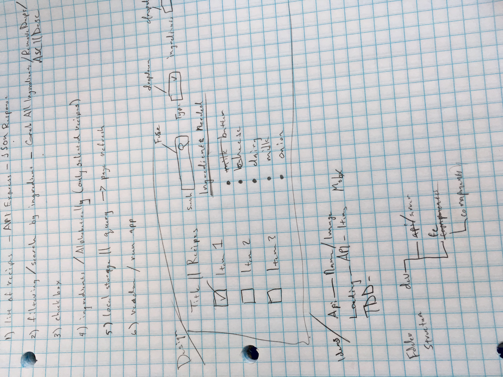

FE/Full Stack Code Challenge for DataScience
============================================

<!-- Working Example [GitHub App](https://ottoinfo.github.io/DataScience-Code-Test/) -->

[DataScience Challenge](https://github.com/datascienceinc/frontend-code-test)

Code Test
---------
Used Express, React, Mobx (for State Management), Webpack, CSS Modules, Sass Resources

This is pretty much a boilerplate workflow I have been using lately. Decided to try running webpack through the Express Server instead of going through a PROXY Server setup and having to open 2 terminal windows.

Worked on and off for 24 hours on this code challenge with a list of things to get done. Sketched out notes and quick wireframe along with ideas of how to improve the experience. Didn't get to complete all ideas, but did what I could.

Express 2 route api 
  - API for recipes FS read JSON file
  - API for redirect to Webpack build dist folder

React FE Goals
  - List of Recipes 
  - Filtering/Search by ingredients
  - Check Box for displaying Ingredients
  - List of Ingredients of selected recipes ( remove duplicates & sort alphabetically)
  - Local Storage || Query Params to reload STATE on page refresh __(WIP / Not Completed)__

Notes/Ideas




Install/Run Locally
-------------------
open Terminal

Install Node Modules

```npm install```

This will start up Server on [localhost:3000](http://localhost:3000)

```npm run server```